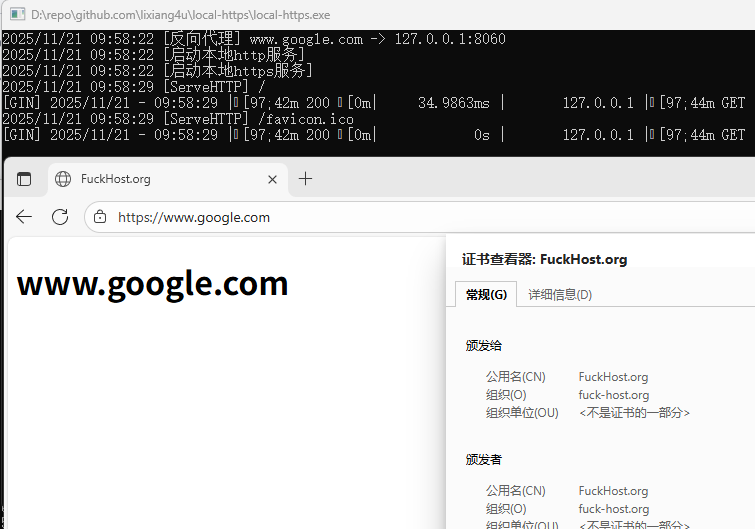

## 本地https服务

### 配置方式

1、本地启动`www.google.com`域名服务，使用默认web服务
```code
{
  "cert_name": "fuck-host.org",
  "proxy": {
    "www.google.com": ""
  }
}
```

2、本地启动`www.google.com`域名服务，转发到`http://192.168.1.2:8090`服务
```
{
  "cert_name": "fuck-host.org",
  "proxy": {
    "www.google.com": "http://192.168.1.2:8090"
  }
}
```


